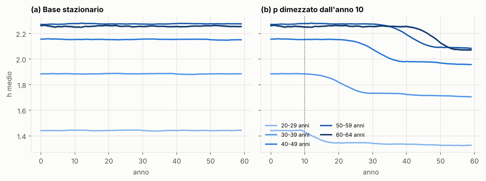
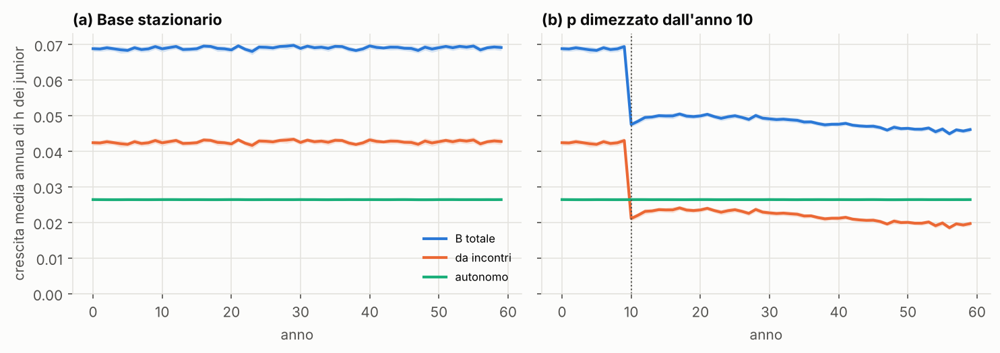
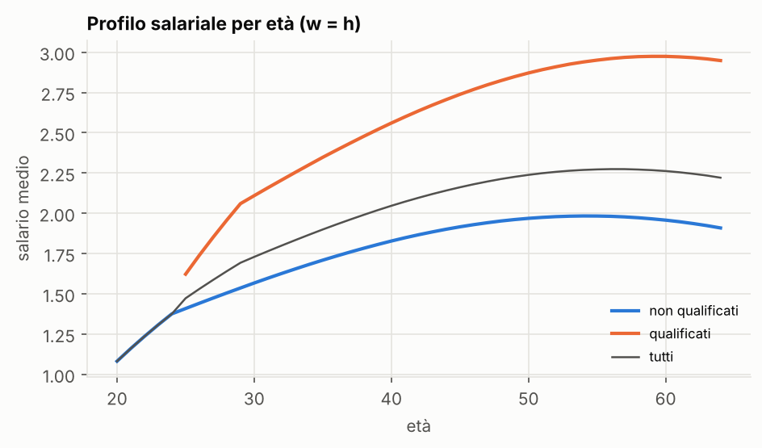
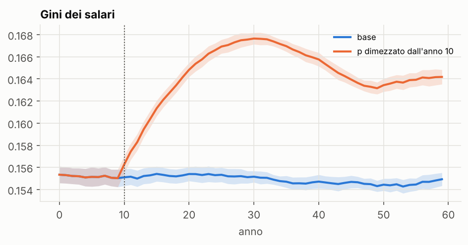
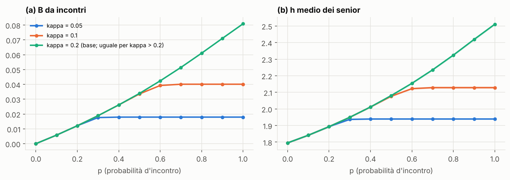

# Sintesi — Fase 1: modello base senza IA

*Generata dai risultati di `python scripts/make_report.py` (30 repliche per scenario,
seed radice 20261008). I numeri citati sono in `report/numeri_fase1.json`.*

## 1. Cosa fa il modello

N = 5.000 lavoratori, un periodo = un anno. Ogni lavoratore *i* ha età $a_i$, anni di
esperienza $s_i$, qualifica (alta/bassa) e capitale umano $h_i$. Il parametro di
efficienza dell'apprendimento di Lucas (1988), $B$, **non è un parametro**: è misurato
come crescita media di $h$ dei junior, e dipende dagli incontri con i senior.

## 2. Equazioni come effettivamente implementate

Ordine degli eventi nell'anno *t* (`src/skillcliff/model.py`):

1. **Invecchiamento.** $a_i \leftarrow a_i + 1$, $s_i \leftarrow s_i + 1$.
2. **Pensionamento.** Esce chi ha $a_i \ge 65$.
3. **Ingresso.** Nella modalità stazionaria entrano tanti junior quanti sono i pensionati (N costante). Per ciascun entrante:
   - qualifica alta con probabilità $q = 0{,}30$;
   - età d'ingresso 20 anni (bassa) o 25 anni (alta), con $s = 0$;
   - capitale umano iniziale

$$h_{i,0} = \bar h_0(\text{qualifica})\cdot e^{\varepsilon_i},\qquad \varepsilon_i\sim\mathcal N(-\sigma^2/2,\ \sigma^2),\qquad \bar h_0 = 1{,}0\ /\ 1{,}5.$$

4. **Ruoli** (in base all'esperienza, non all'età). Junior se $s<5$, senior se $s\ge 15$; gli altri sono "intermedi".
5. **Incontri** (`learning.py`). Con $J$ junior e $S$ senior, la probabilità effettiva d'incontro è

$$p^{\text{eff}}_t = \min\!\left(p,\ \kappa\,\frac{S_t}{J_t}\right),$$

cioè incontri = min(domanda $pJ$, capacità $\kappa S$). Ogni junior *j* incontra con probabilità $p^{\text{eff}}_t$ un senior *k* estratto uniformemente, e guadagna

$$\Delta h^{\text{inc}}_j = \beta\,\max(0,\ h_k - h_j).$$

Il senior non perde nulla dall'incontro.

6. **Apprendimento autonomo e obsolescenza** (alla Ben-Porath). Per tutti:

$$\Delta h^{\text{aut}}_i = \big[\delta(s_i) - d\big]\,h_i,\qquad \delta(s) = \delta_0\,\max\!\left(0,\ 1-\frac{s}{S_h}\right).$$

7. **Aggiornamento simultaneo.** $h_i \leftarrow h_i + \Delta h^{\text{inc}}_i + \Delta h^{\text{aut}}_i$, con entrambi i termini calcolati sullo stesso $h$ di inizio anno. Vale $h\ge 0$ perché $d<1$.
8. **Output e salari.** $Y_t=\sum_i h_i$ e $w_i = \partial Y/\partial h_i \cdot h_i = h_i$.
9. **B emergente.** Media tra i junior della crescita relativa, scomposta:

$$B_t = \underbrace{\tfrac{1}{J_t}\sum_{j}\tfrac{\Delta h^{\text{inc}}_j}{h_j}}_{B^{\text{inc}}_t} + \underbrace{\tfrac{1}{J_t}\sum_{j}\tfrac{\Delta h^{\text{aut}}_j}{h_j}}_{B^{\text{aut}}_t}.$$

   Con $u=1$, nella notazione di Lucas $\dot h/h = B\,u$ coincide con $B$.

**Riproducibilità.**
- La replica *r* usa `SeedSequence(seed).spawn(30)[r]`.
- Gli stream per demografia e incontri sono separati.
- Le estrazioni casuali degli incontri avvengono sempre per tutti i junior. Così due scenari con lo stesso seed hanno le stesse uscite demografiche e accoppiano gli incontri (common random numbers).
- Burn-in di 120 anni, poi 60 anni registrati.
- Gli intervalli di confidenza (IC) sono al 95%, con t di Student tra repliche.

## 3. Parametri

| Parametro | Valore | Fonte / motivazione | Arbitrario? |
|---|---|---|---|
| N | 5.000 | specifica | — |
| Età d'ingresso | 20 / 25 | Laureati italiani entrano tardi (prevalenza della laurea magistrale) | approssimato |
| Pensionamento | 65 | Uscita effettiva media 64,8 anni nel 2024 (Italia) | approssimato |
| Quota qualificati $q$ | 0,30 | ~30% di laureati tra i 25–34enni | approssimato |
| $\bar h_0$ | 1,0 / 1,5 | Premio salariale d'ingresso dei laureati ~50% | **sì** (normalizzazione) |
| $\sigma$ (rumore h₀) | 0,20 | — | **sì** |
| Junior / senior | $s<5$ / $s\ge 15$ | Evidenza IA su entry-level (22–25enni; ruoli junior) | scelta condivisa |
| $p$ | 0,6 | — | **sì**; insieme a β fissa $B^{inc}$ |
| $\kappa$ | 0,2 | un senior su cinque fa da mentore ogni anno | **sì** |
| $\beta$ | 0,10 | Calibrato: $B^{inc}\approx 4$–9% (Jarosch et al. 2021) | calibrato |
| $\delta_0,\ S_h,\ d$ | 0,040 / 50 / 0,012 | Calibrati sul profilo concavo con picco tardo e calo finale lieve | calibrati |

## 4. Risultati

### 4.1 h medio per classe d'età nel tempo

Il pannello (a) mostra lo stato stazionario: livelli costanti e ordinati per età.

Il pannello (b) è un **esperimento di meccanismo, non uno scenario IA**: dall'anno 10 la probabilità di incontro *p* viene dimezzata. Serve a isolare il canale su cui agirà l'IA.
- Il calo è **immediato per i 20–29enni**: −5,6% di h junior dopo 4 anni.
- Per i senior il calo è **ritardato**:
  - variazione **esattamente nulla** dopo 5 anni (sono gli stessi individui, già formati);
  - −3,5% dopo 25 anni;
  - −6,7% a regime.
- Le classi 40–49, 50–59 e 60–64 iniziano a scendere rispettivamente circa 15, 20–25 e 30 anni dopo lo shock.
- L'output a regime scende del 7,1%.

Questo è il meccanismo della skill cliff: il danno si trasmette con il ritardo di una generazione.

### 4.2 B emergente

**A regime:**

| | Valore | IC 95% | Quota di B |
|---|---|---|---|
| $B$ | 0,0709 | [0,0708; 0,0710] | — |
| $B^{inc}$ (da incontri) | 0,0445 | — | 63% |
| $B^{aut}$ (autonomo) | 0,0264 | — | 37% |

**Dopo lo shock**, $B^{inc}$ si dimezza (da 0,045 a 0,022) e poi segue due fasi:
- **sale** a 0,025 nei 5–20 anni successivi, perché i junior partono da più in basso e il divario da colmare con i senior è più grande;
- **scende** fino a 0,021 a 50 anni dallo shock, quando arrivano i senior formati dopo lo shock, che hanno meno da insegnare.

È l'effetto intergenerazionale alla Lucas–Moll: B dipende dalla distribuzione di conoscenza, non è una costante.

### 4.3 Profilo salariale per età

| | Picco (età / esperienza) | Picco / ingresso | Calo finale dal picco |
|---|---|---|---|
| Non qualificati | 54 / 34 anni | 1,90 | −3,7% |
| Qualificati | 59 / 34 anni | 1,72 | −0,9% |

### 4.4 Disuguaglianza

Il Gini dei salari a regime è **0,135** (IC [0,134; 0,135]). Dimezzare gli incontri lo porta a circa 0,154: **gli incontri comprimono la disuguaglianza**, perché i junior convergono verso i senior.

### 4.5 Sensibilità a p e κ

- $B^{inc}$ cresce in modo più che lineare con *p*, per l'effetto cumulativo descritto sopra.
- Il vincolo di capacità diventa attivo quando $p > \kappa S/J$.
- A regime $S/J = 5{,}70$, quindi con $\kappa = 0{,}2$ il vincolo **non è attivo** ($p^{eff}=p$). Lo diventa solo se $S/J$ scende sotto $p/\kappa = 3$.

### 4.6 Docking NumPy ↔ Mesa

Il gemello in Mesa 3.5 (`src/skillcliff/mesa_twin.py`) applica le stesse regole con un oggetto per agente, scritto indipendentemente. Confronto con N = 1.000 e 20 repliche per ciascuna implementazione:

| Metrica | NumPy | Mesa | Diff. | p (Welch) |
|---|---|---|---|---|
| h medio | 1,9900 | 1,9858 | −0,21% | 0,34 |
| h junior | 1,4157 | 1,4110 | −0,33% | 0,19 |
| h senior | 2,1652 | 2,1613 | −0,18% | 0,42 |
| $B^{inc}$ | 0,0444 | 0,0444 | +0,12% | 0,86 |
| $B^{aut}$ | 0,0264 | 0,0264 | 0,00% | 0,76 |

Nessuna differenza è significativa. Mesa è circa 5 volte più lento con N = 1.000 e circa 10 volte con N = 5.000, perché il costo per agente cresce. È adatto come verifica, non per le analisi di sensibilità.

## 5. Verifiche

**Riprodotto**
- **Profilo salariale concavo con calo finale lieve.** Picco a 34 anni di esperienza, calo finale tra −1% e −4%. È coerente con il settore privato italiano: salita lenta e plateau.
- **B emergente.** Dipende da *p*, κ, β e dalla distribuzione di *h* dei senior.
- **Meccanismo della skill cliff.** Una riduzione degli incontri colpisce subito i junior e solo con 15–30 anni di ritardo le classi più anziane, con effetto cumulativo tra generazioni.
- **Invarianti.** I test verificano: N conservato, $h\ge0$, *p*=0 ⇒ nessun apprendimento da incontri (traiettoria identica a β=0), stesso seed ⇒ risultati identici, demografia identica tra scenari con lo stesso seed.

**Non torna**
1. **Pendenza per qualifica invertita.** I non qualificati hanno un profilo più ripido (1,90) dei qualificati (1,72). L'evidenza (Lagakos et al. 2018) dice il contrario: profili più ripidi per chi ha istruzione alta.
   - Causa: i junior incontrano senior estratti dall'intero pool, quindi un junior non qualificato ha un divario di *h* più grande da colmare. Inoltre la sua carriera è più lunga.
   - Con incontri solo all'interno della stessa qualifica, una prova esplorativa con 5 repliche dà profili circa uguali (1,84 contro 1,83), ma non invertiti.
2. **Gini troppo basso (0,135).** Nei dati i salari dei dipendenti privati hanno un Gini di circa 0,3 (ordine di grandezza, da verificare su INPS). Il modello ha *h* come unica determinante del salario: mancano imprese, settori, contrattazione, part-time. Non lo considero un obiettivo di calibrazione.
3. **Nessuna crescita di lungo periodo.** Con $h_0$ fisso l'economia è stazionaria: c'è B, ma non c'è crescita endogena alla Lucas. È una scelta deliberata per la fase 1.
4. **Nessuna "cliff" spontanea nel caso base.** Con demografia stazionaria il rapporto S/J è costante e il vincolo κ non è mai attivo. Una skill cliff richiede uno shock: l'IA (fase 2) oppure una piramide demografica sbilanciata (caso Italia).
5. **Mappatura con Jarosch et al. solo indicativa.** Loro misurano il valore dell'apprendimento da *tutti* i colleghi come quota della retribuzione di *tutti* i lavoratori. Qui misuriamo solo l'apprendimento dei junior dai senior.

**Scelte arbitrarie**
- La forma lineare di δ(s), che produce la concavità.
- *p* e β presi separatamente: conta soprattutto il loro prodotto.
- κ = 0,2.
- La normalizzazione di $\bar h_0$ e σ.
- Il senior estratto uniformemente; al massimo un incontro l'anno.
- Il pensionamento deterministico a 65 anni.
- Le soglie 5/15 (la robustezza con 10/20 è prevista ma non ancora mostrata qui).
- w = h esatto.

## 6. Decisioni aperte (formato D: opzione raccomandata per prima)

- **D1 – Con chi si incontrano i junior?**
  - **B (raccomandata):** senior della stessa qualifica. È più realistico (si impara da chi fa il tuo mestiere) e serve nella fase 2 per i target "qualificati / non qualificati": la sostituzione di un gruppo deve ridurre gli incontri *in quel gruppo*.
  - A: estrazione dall'intero pool, come ora.
- **D2 – Apprendimento autonomo diverso per qualifica?**
  - **A (raccomandata):** no. Teniamo il modello essenziale e dichiariamo nelle Verifiche che i profili per qualifica sono simili.
  - B: sì ($\delta_0$ più alto per i qualificati, un parametro in più). Riproduce profili più ripidi per chi ha istruzione alta.
- **D3 – Gini.**
  - **A (raccomandata):** resta un risultato non calibrato.
  - B: calibriamo σ per avvicinarci a ~0,3. Questo cambierebbe anche i guadagni da incontro.
- **D4 – κ.**
  - **A (raccomandata):** 0,2, non attivo a regime e attivo con forti cali di senior.
  - B: 0,1, appena attivo già a regime ($p^{eff}=0{,}57$): il modello diventa subito sensibile al numero di senior.
- **D5 – Robustezza 10/20.**
  - **A (raccomandata):** la aggiungo a questa sintesi prima della fase 2 (pochi secondi di calcolo).
  - B: la rimando alla fase 2.

## Fonti

- Jarosch, Oberfield, Rossi-Hansberg (2021), *Learning from Coworkers*, Econometrica 89(2).
- Lagakos, Moll, Porzio, Qian, Schoellman (2018), *Life Cycle Wage Growth across Countries*, JPE 126(2).
- Brynjolfsson, Chandar, Chen (2025), *Canaries in the Coal Mine?*, Stanford Digital Economy Lab.
- Hosseini, Lichtinger (2025), *Generative AI as Seniority-Biased Technological Change*, SSRN 5425555.
- Axtell, Axelrod, Epstein, Cohen (1996), *Aligning Simulation Models*, Comput. Math. Organ. Theory.
- OCSE/INPS su età effettiva di pensionamento (ANSA, 16/07/2025: 64,8 anni nel 2024).
