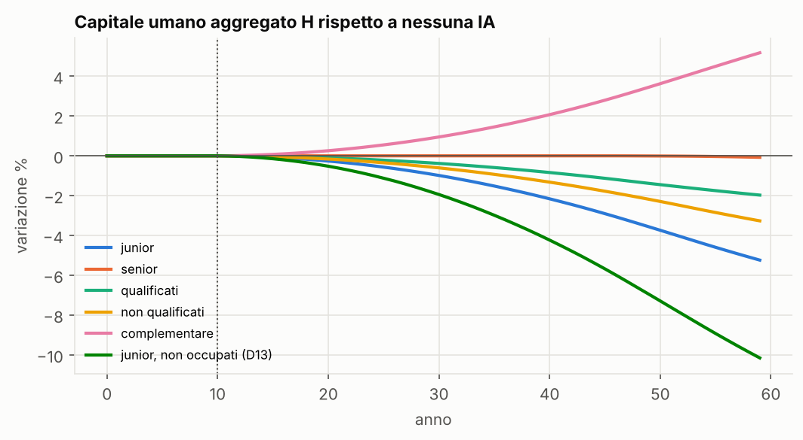
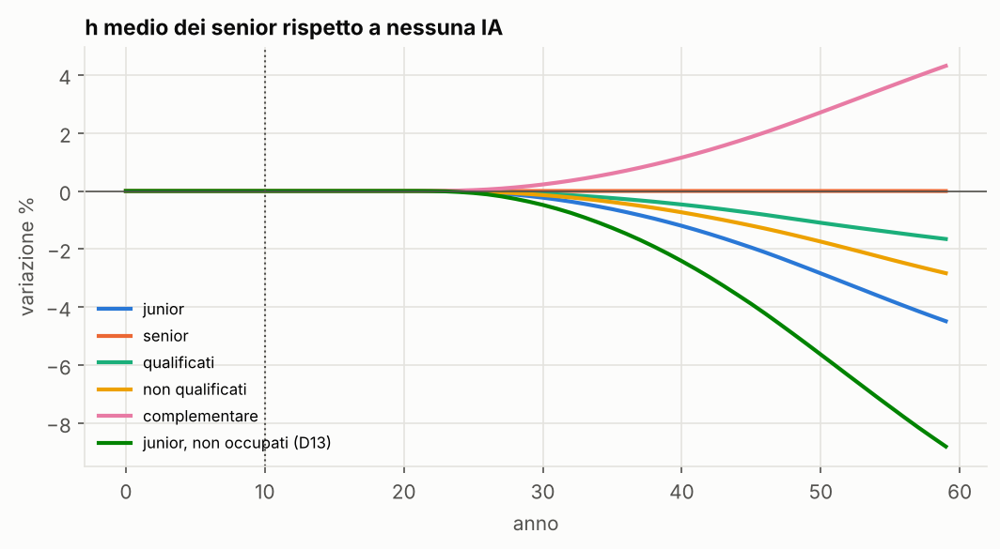
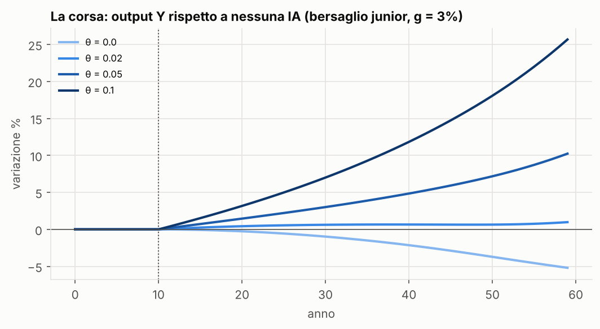
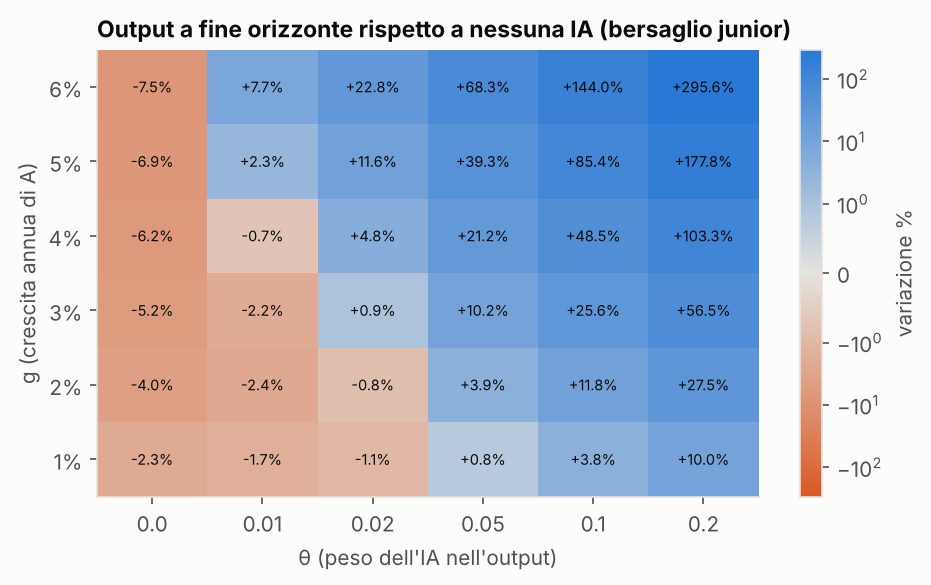
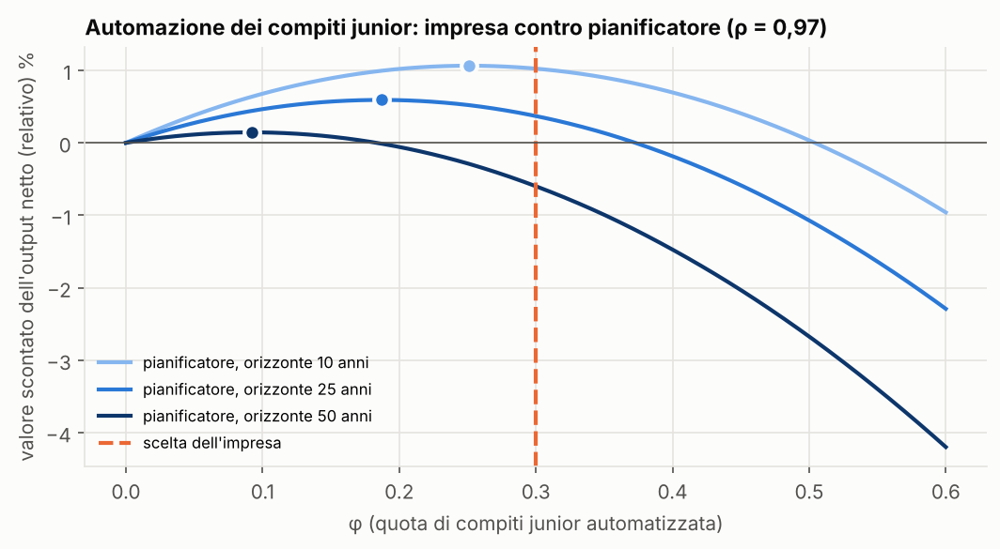

# Sintesi — Fase 2: l'intelligenza artificiale

*Federico Bassi e Vincenzo Lio. Numeri generati da `python scripts/fase2.py`
(N = 50.000, 30 repliche per scenario, seed radice 20261008) e salvati in `report/numeri_fase2.json`.
Versione interattiva: [fase 2 sul sito](https://viciuslio.github.io/skill-cliff-abm/fase2.html).*

## 1. Cosa aggiunge la fase 2

Il modello della fase 1 resta identico. L'IA arriva all'anno 10 e agisce su due canali:
- **sugli incontri:** riduce o potenzia le occasioni di apprendimento, secondo chi sostituisce;
- **sull'output:** aggiunge produttività che cresce nel tempo.

Ogni scenario usa gli stessi numeri casuali dello scenario senza IA (common random numbers):
le differenze sono dovute solo all'IA, e prima dell'anno 10 i risultati sono identici al bit (verificato dai test).

## 2. Equazioni come implementate (`src/skillcliff/ai.py`)

**Produttività dell'IA e quota di compiti automatizzati.** Con $t_0 = 10$:

$$A_t = (1+g)^{\,t-t_0}\ \text{per}\ t\ge t_0,\quad A_t = 1\ \text{prima};\qquad \varphi_t = \varphi_{\max}\left(1 - \frac{1}{A_t}\right).$$

$\varphi$ parte da zero, cresce con A e si satura a $\varphi_{\max}$. Poiché $A_{t_0} = 1$, l'IA agisce dall'anno $t_0 + 1$.

**Bersagli.** L'IA moltiplica i parametri degli incontri di ciascun gruppo di qualifica:

| Bersaglio | Cosa cambia | Lettura |
|---|---|---|
| junior | $p \times (1-\varphi_t)$ in entrambi i gruppi | meno lavoro junior, meno affiancamento |
| senior | $\kappa \times (1-\varphi_t)$ in entrambi i gruppi | meno senior disponibili come mentori |
| qualificati | $p$ e $\kappa$ del gruppo H $\times (1-\varphi_t)$ | sostituzione del lavoro qualificato |
| non qualificati | $p$ e $\kappa$ del gruppo L $\times (1-\varphi_t)$ | sostituzione del lavoro non qualificato |
| complementare | $\beta \times (1+\varphi_t)$ in entrambi i gruppi | l'IA rende più efficace l'insegnamento |

**Output.** Con $H_t = \sum_i h_{i,t}$:

$$Y_t = H_t\,\big[1 + \theta\,(A_t - 1)\big].$$

θ non entra nella dinamica degli agenti: la "corsa" si calcola quindi per qualsiasi θ a partire da $H_t$ e $A_t$, senza nuove simulazioni.

**Variante "junior non occupati" (D13).** Con `ai.displacement` la sostituzione dei junior non riduce p: ogni anno
una quota $\varphi_t$ dei junior del gruppo colpito è senza lavoro. Un junior non occupato non incontra senior e non
impara sul lavoro; resta solo l'obsolescenza, $\Delta h_{i,t} = -d\,h_{i,t}$. I suoi compiti li svolge l'IA, quindi
l'output corrente non cambia: la perdita passa solo per il capitale umano. Le estrazioni per la non occupazione
usano un flusso di numeri casuali dedicato, così gli altri flussi restano allineati con lo scenario senza IA.

## 3. Parametri

| Parametro | Valore | Criterio |
|---|---|---|
| $t_0$ | 10 | lascia 50 anni di orizzonte dopo l'introduzione |
| $g$ | 3% (griglia 1–6%) | crescita della produttività dell'IA; arbitraria, quindi esplorata |
| $\varphi_{\max}$ | 0,6 | dopo 10 anni $\varphi$ = 0,15, coerente con il −13/16% di occupati di 22–25 anni nelle occupazioni esposte (Brynjolfsson et al. 2025) |
| $\theta$ | 0,02 (griglia 0–0,2) | +0,7% di produttività in 10 anni, come la stima prudente di Acemoglu (2024) |
| N | 50.000 | il modello è invariante alla scala (sez. 6) |

## 4. Risultati

### 4.1 Chi viene sostituito conta

Variazioni rispetto allo scenario senza IA, a fine orizzonte (50 anni dopo l'introduzione):

| Bersaglio | H | h senior | B da incontri | Y (θ = 0,02) | Gini | Anni al primo effetto sui senior |
|---|---|---|---|---|---|---|
| junior | −5,2% | −4,5% | −45% | +1,0% | 0,163 | 12 |
| non qualificati | −3,2% | −2,8% | −31% | +3,1% | 0,170 | 12 |
| qualificati | −2,0% | −1,7% | −13% | +4,4% | 0,148 | 12 |
| senior | −0,1% | 0,0% | −2% | +6,4% | 0,155 | 42 |
| complementare | +5,2% | +4,3% | +45% | +12,0% | 0,150 | 12 |
| junior, non occupati (D13) | −10,1% | −8,8% | −46% | −4,3% | 0,169 | 12 |

*Senza IA il Gini è 0,155. Nella variante D13, B da incontri è la media su tutti i junior, compresi i non occupati.*

1. **Sostituire i junior è il caso peggiore.** H scende del 5,2% e l'apprendimento da incontri quasi si dimezza. Il primo effetto sui senior arriva **12 anni** dopo l'introduzione: un anno perché l'IA inizi ad agire, più gli 11 anni della Proposizione 2.
2. **Sostituire i senior conta solo se i mentori sono scarsi.** Con κ = 0,2 e S/J ≈ 5,7 ci sono più mentori potenziali di quanti ne servano: il vincolo si attiva dopo circa 30 anni e l'effetto a fine orizzonte è quasi nullo. Con κ = 0,1, dove la capacità è già al limite, la stessa sostituzione costa −4,8% di capitale umano, quasi quanto sostituire i junior (sez. 4.3).
3. **Bersagliare i non qualificati costa più che bersagliare i qualificati, e aumenta la disuguaglianza.** Il Gini sale a 0,170 se l'IA sostituisce i non qualificati e scende a 0,148 se sostituisce i qualificati. Il motivo principale è il peso: i non qualificati sono il 70% degli entranti.
4. **L'IA complementare è lo specchio della sostituzione dei junior.** Con la stessa intensità $\varphi$, H sale del 5,2% e l'output del 12%.
5. **Se i junior sostituiti restano senza lavoro (D13) il danno raddoppia.** H scende del 10,1% e i senior dell'8,8%. Con θ = 0,02 l'output finisce sotto lo scenario senza IA (−4,3%): la soglia di pareggio sale da 0,017 a circa 0,035.

### 4.3 Sensibilità a κ per il bersaglio senior (D14)

| κ | p effettiva senza IA | H a fine orizzonte | h senior | Primo effetto su H |
|---|---|---|---|---|
| 0,05 | 0,29 (vincolo attivo) | −2,3% | −2,0% | subito |
| 0,1 | 0,57 (vincolo appena attivo) | −4,8% | −4,1% | subito |
| 0,2 | 0,60 (vincolo inattivo) | −0,1% | 0,0% | dopo 31 anni |

Con κ = 0,05 la perdita è minore che con 0,1 perché gli incontri sono già pochi senza IA: c'è meno da perdere.
Il dato empirico che servirebbe è quanti senior fanno davvero da mentori.

### 4.2 La corsa

Con θ = 0,02 (Acemoglu) e bersaglio junior, **la perdita di capitale umano si mangia circa l'85% del guadagno di produttività dell'IA**:
- senza perdita di H l'output sarebbe +6,5% a fine orizzonte;
- con la skill cliff è +1,0%, quasi fermo (+0,6% / +0,7%) tra 20 e 30 anni dopo l'introduzione.

| g | H a fine orizzonte | θ di pareggio |
|---|---|---|
| 1% | −2,3% | 0,037 |
| 2% | −4,0% | 0,025 |
| 3% | −5,2% | 0,017 |
| 4% | −6,1% | 0,011 |
| 5% | −6,9% | 0,007 |
| 6% | −7,4% | 0,005 |

- **IA più veloce, perdita più grande.** Una crescita più rapida di A automatizza prima e aumenta la perdita di capitale umano.
- **Ma anche guadagno più grande.** Con A esponenziale, il guadagno di output cresce più in fretta della perdita, che si satura con $\varphi_{\max}$; la soglia θ per andare in pari quindi scende.
- **Con θ = 0** (IA che sostituisce senza aggiungere output) l'output cade esattamente come H.

### 4.4 Automazione scelta dall'impresa contro ottimo sociale (D15)

Script `scripts/automazione.py`, numeri in `report/numeri_d15.json`, figura sotto.

**Impostazione.** Dall'anno 10 una quota costante φ dei compiti junior è automatizzata ($p\times(1-\varphi)$).
L'output netto relativo allo scenario senza automazione è

$$y_t(\varphi) = r_t(\varphi)\left(1 + \pi\varphi - \tfrac{c}{2}\varphi^2\right),\qquad r_t(\varphi) = \frac{H_t(\varphi)}{H_t(0)},$$

con guadagno pieno dell'automazione π = 0,10 e costo di adozione c = 1/3.
- **L'impresa** prende il capitale umano come dato: i contratti di trasmissione della conoscenza sono incompleti (Ide 2026) e chi forma un junior non ne cattura il valore futuro. Sceglie quindi $\varphi = \pi/c = 0{,}30$.
- **Il pianificatore** massimizza $\sum_k \rho^{k+1} y_{t_0+k}(\varphi)$ su un orizzonte dato, con $r_t(\varphi)$ misurato dal modello (griglia di φ, 10 repliche per punto, N = 50.000).

| ρ | Orizzonte | φ ottimo | Eccesso di automazione | Valore della scelta dell'impresa | Valore dell'ottimo |
|---|---|---|---|---|---|
| 0,97 | 10 anni | 0,25 | 0,05 | +1,02% | +1,06% |
| 0,97 | 25 anni | 0,19 | 0,11 | +0,37% | +0,59% |
| 0,97 | 50 anni | 0,09 | 0,21 | **−0,60%** | +0,14% |
| 0,99 | 50 anni | 0,05 | 0,26 | **−1,08%** | +0,04% |

*Valori: output netto scontato rispetto a nessuna automazione.*

1. **L'impresa automatizza troppo, e l'eccesso cresce con l'orizzonte.** Su 10 anni l'eccesso è piccolo (0,05), perché il danno sui senior arriva solo dopo 11 anni (Proposizione 2): chi guarda a dieci anni, come un bilancio o un ciclo politico, sceglie quasi come l'impresa.
2. **Su 50 anni la scelta privata è peggiore di non automatizzare affatto** (−0,6% con ρ = 0,97). Il guadagno immediato è più che compensato dalla perdita di capitale umano.
3. **I valori di π e c sono illustrativi**: determinano il livello di φ scelto dall'impresa, non il segno dell'eccesso, che deriva solo dal fatto che l'impresa non vede $r_t(\varphi)$.

## 5. Verifiche

**Riprodotto e verificato**
- **Prima dell'introduzione** ogni scenario è identico al bit allo scenario senza IA (test per tutti e 5 i bersagli).
- **Ritardo:** con il bersaglio junior l'h dei senior resta identico per $s_S - s_J$ anni dopo l'inizio dell'effetto, come previsto dalla Proposizione 2 (test).
- **Isolamento dei gruppi:** il bersaglio "qualificati" lascia identici i non qualificati (test).
- **Formule:** A, φ e Y seguono le formule (test).

**Cosa non torna o va discusso**
1. **Il risultato sui senior dipende da κ** (sez. 4.3). Senza una misura empirica della capacità di mentoring, il bersaglio senior va presentato come un intervallo: da quasi nullo a −4,8%.
2. **A cresce senza limiti.** Con A esponenziale e θ > 0 l'IA vince sempre nel lunghissimo periodo; la corsa è interessante sull'orizzonte di una o due generazioni, non all'infinito.
3. **Due modi di sostituire i junior.** Nella versione base restano occupati e incontrano meno; nella variante D13 restano senza lavoro e il danno raddoppia. La realtà sta probabilmente in mezzo: chi non entra in un'impresa esposta trova spesso lavoro altrove, con meno apprendimento.
4. **L'IA è esogena.** Nessuna impresa sceglie se automatizzare. Il fallimento di mercato di Ide (automazione socialmente eccessiva) richiede una scelta d'impresa: è il passo successivo.
5. **Il caso complementare è simmetrico per costruzione** (β × (1+φ)). Non c'è il calo di sforzo dei co-pilot descritto da Ide, che lo renderebbe meno favorevole.
6. **θ e g sono incerti.** Per questo sono esplorati su griglia; la stima di Acemoglu è prudente, altre sono molto più alte.

**Stabilità numerica (controlli dell'8 ottobre)**
- **Burn-in.** 120 anni non bastano del tutto: la convergenza è lenta perché ogni generazione impara dalla precedente. Con 300 anni l'h dei senior è più alto dello 0,4% e la deriva residua scende da +1,0·10⁻⁴ a −0,9·10⁻⁵ l'anno (relativa). I confronti tra scenari cambiano pochissimo (H con bersaglio junior: −5,20% con 120 anni, −5,26% con 300, −5,23% con 480). **Da fare:** portare il burn-in a 300 anni e rigenerare i numeri.
- **Esistenza dello stato stazionario.** Con parametri estremi (p = 1, κ = 1, β = 0,5) il capitale umano cresce senza limite: gli incontri diventano un motore di crescita endogena alla Lucas. Con la calibrazione di base l'economia è stazionaria. La soglia tra i due regimi va caratterizzata (analiticamente con la Proposizione 1, o numericamente su una griglia di p e β).
- **Robustezza dei risultati.** Invarianza alla scala (5 mila – 24 milioni), docking con Mesa, seed diversi (IC al 95% molto stretti), soglie 10/20: le conclusioni qualitative non cambiano.

**Scelte arbitrarie:** la forma $\varphi = \varphi_{\max}(1 - 1/A)$; la forma moltiplicativa di Y; $t_0$ = 10; la stessa φ per tutti i bersagli.

## 6. Scala: quanti agenti servono?

Il modello è **invariante alla scala**: gli agenti interagiscono attraverso estrazioni casuali dentro pool grandi, non attraverso reti locali. N riduce solo il rumore.

| N | Repliche | Tempo | B | B da incontri | h senior | Gini |
|---|---|---|---|---|---|---|
| 5.000 | 30 | 0,4 s | 0,06903 | 0,04263 | 2,1568 | 0,1549 |
| 50.000 | 30 | 2,6 s | 0,06898 | 0,04258 | 2,1566 | 0,1547 |
| 500.000 | 10 | 11,4 s | 0,06898 | 0,04258 | 2,1570 | 0,1548 |
| 5.000.000 | 3 | 75 s | 0,06899 | 0,04259 | 2,1569 | 0,1548 |
| **24.000.000** (occupati in Italia) | 1 | 589 s, 2,5 GB | 0,06899 | 0,04259 | 2,1569 | 0,1548 |

Tempi con 4 core: le repliche girano in parallelo, quindi la riga da 24 milioni (una sola replica) ha usato un solo core.
Conclusione: 5.000 agenti sono un campione sufficiente per le medie, 50.000 restringono gli intervalli
di confidenza per i confronti tra scenari; la scala reale è possibile ma non cambia i risultati.

## 7. Decisioni (formato D: opzione raccomandata per prima)

- **D11 – Come l'IA riduce gli incontri.**
  - **A (implementata):** moltiplicatore $(1-\varphi_t)$ con $\varphi = \varphi_{\max}(1-1/A)$.
  - B: logistica nel tempo.
- **D12 – Output.**
  - **A (implementata):** $Y = H(1+\theta(A-1))$, una sola forma per tutti i bersagli.
  - B: forme diverse per sostituzione e complementarità (task-based alla Acemoglu).
- **D13 – Junior sostituiti.** Fatto: la versione base (restano occupati, incontrano meno) resta il riferimento; la variante "non occupati" (`ai.displacement`) è implementata, testata e riportata accanto (sez. 4.1).
- **D14 – Sensibilità a κ per il bersaglio senior.** Fatta (sez. 4.3).
- **D15 – Scelta d'impresa sull'automazione.** Fatto (sez. 4.4): l'eccesso di automazione va da 0,05 (orizzonte di 10 anni) a 0,21 (50 anni).
